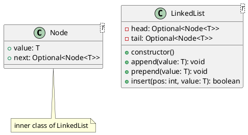

# Linked List

```plantuml
@startuml
class Node<T> {
  +value: T
  +next: Optional<Node<T>>
}
note bottom of Node : inner class of LinkedList

class LinkedList<T> {
  -head: Optional<Node<T>>
  -tail: Optional<Node<T>>
  +constructor()
  +append(value: T): void
  +prepend(value: T): void
  +insert(pos: int, value: T): boolean
}

@enduml
```
